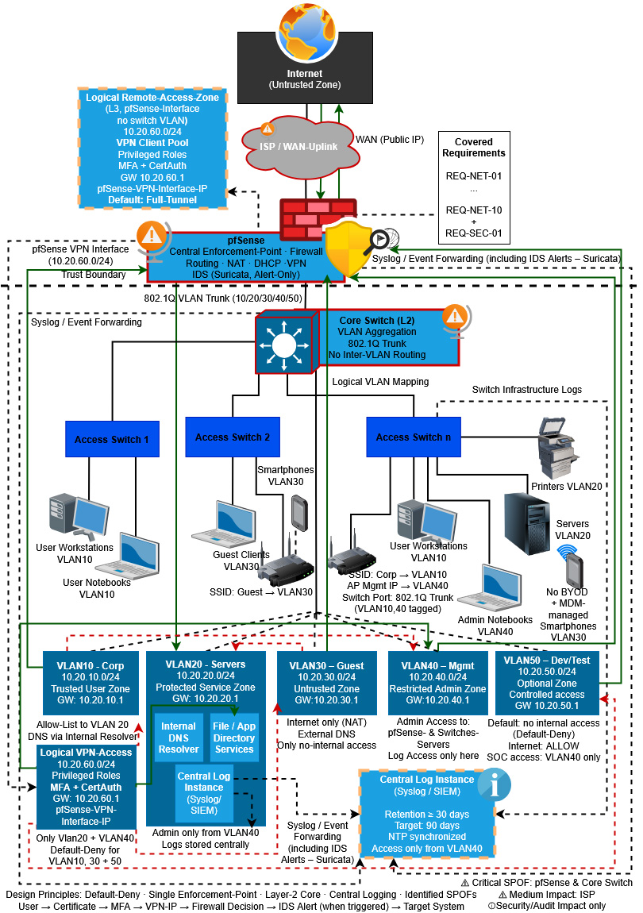

# VECTORFIELD — Enterprise Network Security Architecture Study

Architecture Study | Enterprise Network Security | SOC Readiness

VECTORFIELD is a methodologically grounded and traceability-driven enterprise network security architecture study
that shows how stakeholder constraints, audit pressure, and budget limits can be translated into an operationally realistic security architecture.


---

## Quick Navigation

- Architecture overview → `docs/architecture-summary.md`
- Requirement traceability → `docs/requirements-traceability.md`
- SOC readiness design → `docs/soc-readiness.md`
- Full study (PDF) → `/pdfs/`

---

## Project Summary

**VECTORFIELD** is a scientific network security architecture study in enterprise cybersecurity focused on a fictional mid-sized digital services company.

The project demonstrates how a structured stakeholder interview can act as the **Single Source of Truth (SSoT)** for all subsequent architecture decisions. 
From that foundation, the study derives testable requirements, a framework-based design approach, a zone-centric network architecture, a scalable IP model, 
a logging and monitoring foundation, and a validation logic for SOC readiness.

This repository is the **GitHub companion version** of the project. It is intended as a structured, portfolio-friendly,
and collaboration-ready representation of the study.

---

## Why This Study Exists

Many cybersecurity architecture examples focus on tools rather than
methodology. This project explores how architecture decisions can be
systematically derived from stakeholder requirements, audit findings,
operational constraints, and financial guardrails.

The goal is not to design the most complex architecture, but the most
traceable and operationally sustainable one.

---

## Core Question

> How can a mid-sized enterprise design a secure, segmented, and monitorable network architecture when 
budget limitations, staffing constraints, and the absence of a 24/7 SOC define the operational framework?

---

## Key Characteristics

- Stakeholder-driven requirements engineering
- Traceability from interview → requirement → control → validation
- Zone-centric default-deny architecture
- Central enforcement through pfSense
- VLAN-based segmentation
- Controlled remote access via VPN
- Device-bound certificate authentication + MFA
- Centralized logging and NTP-based event correlation
- IDS in alert-only mode for visibility without inline disruption
- Budget-aware design under **≤ €125,000 CAPEX**
- Structural SOC readiness without assuming a 24/7 SOC

---

## Architecture Scope

<p align="center">

</p>

The study implements segmented security zones using VLAN-based network segmentation:

- **VLAN 10 — Corp**
- **VLAN 20 — Servers**
- **VLAN 30 — Guest / BYOD**
- **VLAN 40 — Mgmt**
- **VLAN 50 — Dev/Test (optional)**

- **VPN subnet 10.20.60.0/24** as a logical Layer-3 extension on pfSense

All inter-zone communication is controlled via a **central default-deny enforcement model**.

---

## Security Logic

The architecture is not built around “more tools”, but around **methodological rigor**:

- no flat internal trust
- no unmanaged admin access
- no implicit remote trust
- no undocumented firewall relationships
- no monitoring without time-consistent evidence

The design emphasizes:

- **containment over convenience**
- **traceability over complexity**
- **evidence over declarations**
- **growth through configuration instead of redesign**

---

## Validation Focus

The architecture is validated against three measurable acceptance goals:

- **G-01** Effective zone separation
- **G-02** Stable basic services in daily operations
- **G-03** Forensic traceability / SOC readiness

These goals are backed by requirement-based validation logic and centrally correlatable evidence chains.

---

## Repository Structure

The repository is organized into architecture documentation, 
supporting assets, and the full study publication.

```text
.
├── README.md
├── CITATION.cff
├── VIDEO_WALKTHROUGH.md
├── codemeta.json
├── LICENSE.md
├── CHANGELOG.md
│
├── ARCHITECTURE_PRINCIPLES.md
├── THREAT_MODEL.md
│
├── CONTRIBUTING.md
├── CODE_OF_CONDUCT.md
├── SECURITY.md
├── SUPPORT.md
│
├── PROJECT_STRUCTURE.md
│
├── .gitignore
│
├── docs/
│   ├── overview.md
│   ├── architecture-summary.md
│   ├── requirements-traceability.md
│   ├── soc-readiness.md
│   ├── architecture-diagram.md
│   ├── validation.md
│   ├── architecture-decisions.md
│   └── references.md
│
├── assets/
│   ├── images/
│   │   ├──00_vectorfield-video-thumb.jpg
│   │   ├──00_VECTORFIELD_Cover.jpg
│   │   ├──00_VECTORFIELD_Portfolio_Cover.jpg
│   │   ├──01_T2_Concept.jpg
│   │   ├──02_K4 0_SSoT.jpg
│   │   ├──03_K4_1_Guideline.jpg
│   │   ├──04_K4_3-4_REQs.jpg
│   │   ├──05_K5_NIST.jpg
│   │   ├──06_K6_2_Zones.jpg
│   │   ├──07_K6_2-1_Isolation.jpg
│   │   ├──08_K6_2-2_Routing.jpg
│   │   ├──09_K6_2-4_DNS.jpg
│   │   ├──10_K7_0_VLAN.jpg
│   │   ├──11_K7_1-4_VPN.jpg
│   │   ├──12_K7_3-3_Monitoring.jpg
│   │   ├──13_K8_3_MFA.jpg
│   │   ├──14_K8_8_MDM.jpg
│   │   ├──15_K9_Risiko1.jpg
│   │   ├──16_K9_Risiko2.jpg
│   │   ├──17_K9_Risiko3.jpg
│   │   └──18_K9_Matrix.jpg
│   └── diagrams/
│       ├── K6_3_Net-Diagram.jpg
│       └── VECTORFIELD_Net-Diagram.drawio
│
└── pdfs/
    ├── ESKme-VECTORFIELD-ENSAS-EN-v1.0.pdf
    └── ESKme-VECTORFIELD-ENSAS-EN-Portfolio-v1.0.pdf
```

---

## Recommended Contents

### `docs/overview.md`
A concise project overview for recruiters, peers, and GitHub visitors.

### `docs/architecture-summary.md`
A compact explanation of the architecture model, security zones, default-deny logic, and monitoring concept.

### `docs/requirements-traceability.md`
A GitHub-friendly summary of the requirement logic:
stakeholders → REQ IDs → architectural decision → validation.

### `docs/soc-readiness.md`
A focused explanation of centralized logging, NTP synchronization, IDS alert-only logic, and forensic event correlation.

### `pdfs/`
The original full study and portfolio PDF.

---

## Project Type

This repository represents a:

- enterprise network security architecture case study
- portfolio project
- traceability-driven security architecture design
- SOC-readiness oriented enterprise network security design

---

## About the Full Study

The full study expands the GitHub version with:

- full stakeholder interview methodology
- detailed requirement derivation
- complete traceability matrices
- architecture logic and IP design
- implementation inventory
- risk assessment and NIST CSF mapping
- glossary and methodological classification

---

## Study Downloads

### English Version of the Study
- Portfolio: https://files.eskme.net/levelup/labs/netarch/vectorfield/ESKme-VECTORFIELD-ENSAS-EN-Portfolio-v1.0.pdf
- Full study: https://files.eskme.net/levelup/labs/netarch/vectorfield/ESKme-VECTORFIELD-ENSAS-EN-v1.0.pdf

### German Version of the Study
- Portfolio: https://files.eskme.net/levelup/labs/netarch/vectorfield/ESKme-VECTORFIELD-ENSAS-DE-Portfolio-v1.0.pdf
- Full study: https://files.eskme.net/levelup/labs/netarch/vectorfield/ESKme-VECTORFIELD-ENSAS-DE-v1.0.pdf

---

## Website

- Website: https://ESKme.net

More resources and learning projects in the ESKme Archive:  
https://files.eskme.net/levelup/labs/

---

## Video Walkthrough

A guided presentation of the architecture is available here:

➡ See **VIDEO_WALKTHROUGH.md**
➡ Project video: https://youtu.be/xlj1juVi7DE

---

## Attribution

Author: **ESKme**  
Brand: **ESKme ∴ Ethical.Shift.Keeper.//me**

---

## License

This project is published under the **Creative Commons Attribution-ShareAlike 4.0 International (CC BY-SA 4.0)** license.

---

## Support

If you find this project valuable and would like to support further open cybersecurity education initiatives:

→ See **SUPPORT.md**

---

## Contact

Maintained by **ESKme**

If you have questions regarding the architecture study, methodology,
or the ESKme learning projects, you can contact the maintainer via:

Email: contact@ESKme.net  
Website: https://ESKme.net

For repository-specific discussions or improvement proposals,
please prefer opening a **GitHub Issue** so that the discussion
remains transparent and accessible to others.