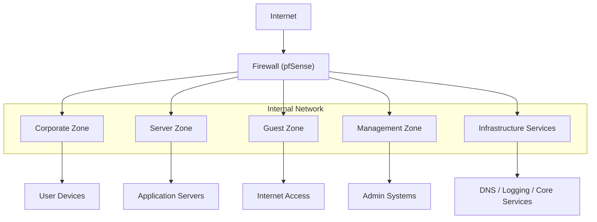
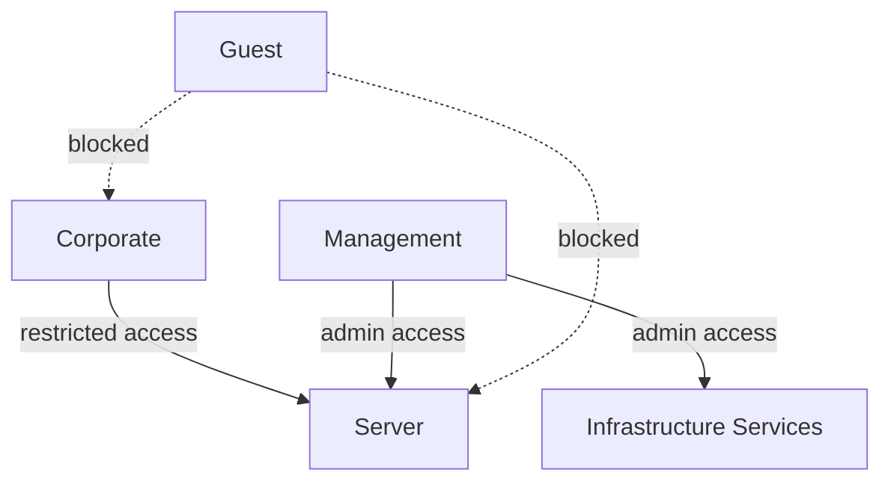

# Architecture Diagram

This document describes the high-level network architecture of the
VECTORFIELD enterprise network security design.

The architecture is based on **segmented security zones**, enforced by a
central firewall and supported by controlled access paths and centralized
monitoring capabilities.

---

## High-Level Network Structure

The network is divided into multiple security zones implemented through
VLAN segmentation.

Each zone represents a **trust boundary** and communication between zones 
is strictly controlled through firewall policy enforcement.

---

The following diagram illustrates the high-level network topology
and the separation of trust zones within the VECTORFIELD architecture.

---

## Security Zones

The architecture separates the network into dedicated security zones:

| Zone                         | Purpose                                                                 |
|------------------------------|-------------------------------------------------------------------------|
| Corporate Zone               | Workstations and internal user devices                                  |
| Server Zone                  | Internal application and service systems                                |
| Guest Zone                   | Untrusted external devices with internet-only access                    |
| Management Zone              | Administrative systems and privileged access                            |
| Infrastructure Services Zone | Core infrastructure services such as: • DNS • Logging / SIEM • Authentication (AD/IdP) • Internal support services |

Each zone is isolated using **VLAN segmentation and firewall policy enforcement**, 
ensuring controlled east-west traffic, enforcing least-privilege access, 
and supporting a zero-trust security model.

---

### Access Control Model

---

## Trust Boundary Enforcement

The pfSense firewall enforces security policies between zones.

Key characteristics include:

- strict default-deny communication model
- explicit rule definitions for allowed services
- controlled inbound service exposure
- DNS access restrictions
- centralized logging of network events

This design limits lateral movement and reduces the attack surface of the
internal network.

---

## Monitoring and Visibility

The architecture integrates monitoring capabilities to support
incident investigation and SOC-readiness.

Key elements include:

- centralized log collection
- time synchronization using NTP
- IDS visibility for anomaly detection
- structured firewall event logging

These components provide **evidence-oriented visibility** into network activity.